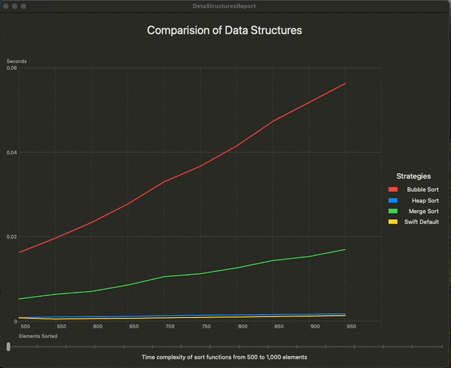

# Swift Data Structures

## Description
This repository contains implementations of various data structures in Swift. It is designed to help developers understand and utilize common data structures in their Swift projects.

## Data Structures
- [Heap](https://github.com/pschuette22/swift-data-structures/blob/main/Sources/Heap.swift)

## Algorithms
- [Heap Sort (in place)](https://github.com/pschuette22/swift-data-structures/blob/main/Sources/Extensions/Array%2BSorting.swift#L40)
- [Merge Sort (in place)](https://github.com/pschuette22/swift-data-structures/blob/main/Sources/Extensions/Array%2BSorting.swift#L78)
- [Bubble Sort](https://github.com/pschuette22/swift-data-structures/blob/main/Sources/Extensions/Array%2BSorting.swift#L131). This is for profiling, don't actually use it.

## Installation
1. Swift Package Manager:
```swift
  dependencies: [
    .package(url: "https://github.com/pschuette22/swift-data-structures", from: "1.0.1"),
  ],
  .target(
    dependencies: [
      .product(name: "DataStructures", package: "swift-data-structures"),
    ],
  ),
```

## Usage
Example of using the Heap data structure:
```swift
import DataStructures

...

var heap = Heap<Int>.minHeap([1,3,6,2,-1,7,-1,4,2])
heap.peek // Output: -1
heap.pop() // Output: -1
heap.push(-2)
heap.peek // Output: -2
```

## Validation Report
Checkout the interactive [DataStructuresReport](https://github.com/pschuette22/DataStructuresReport) Mac App for a visual performance comparision!


